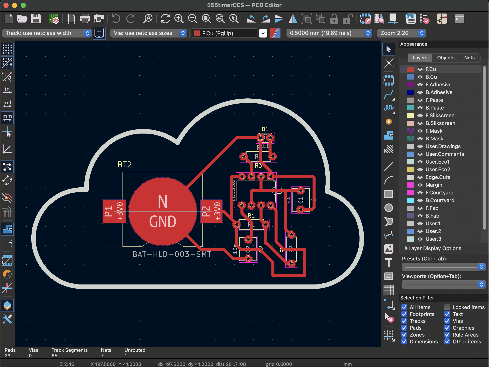
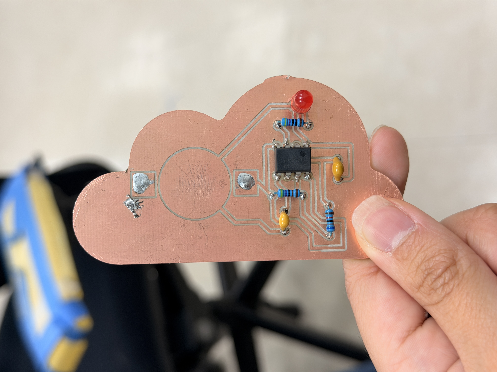
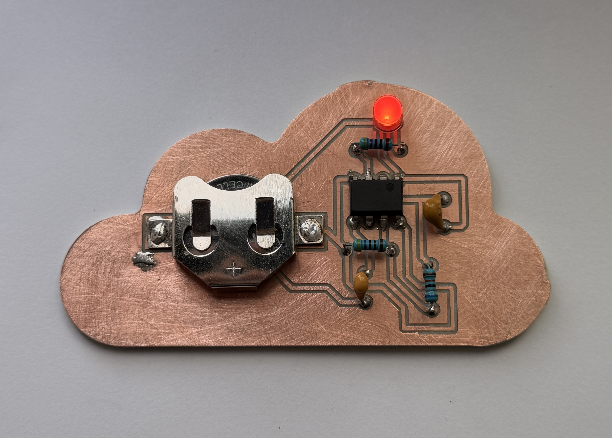
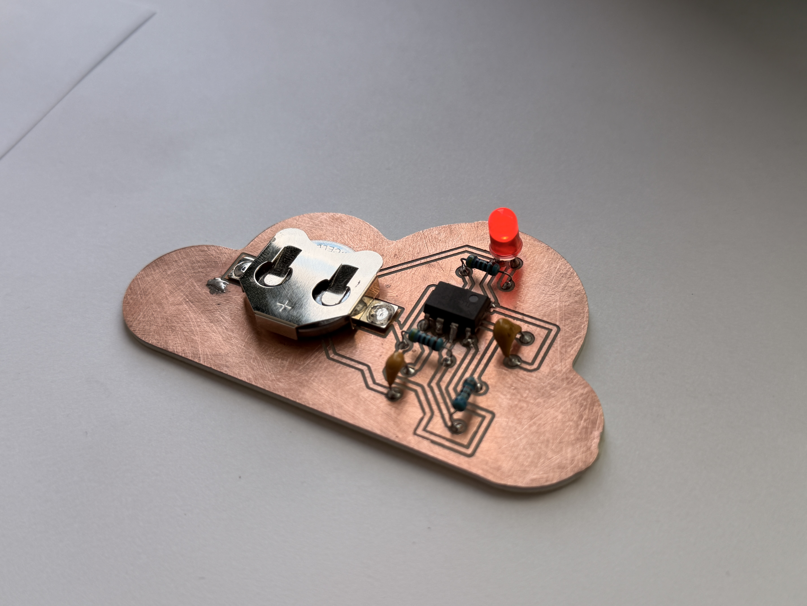
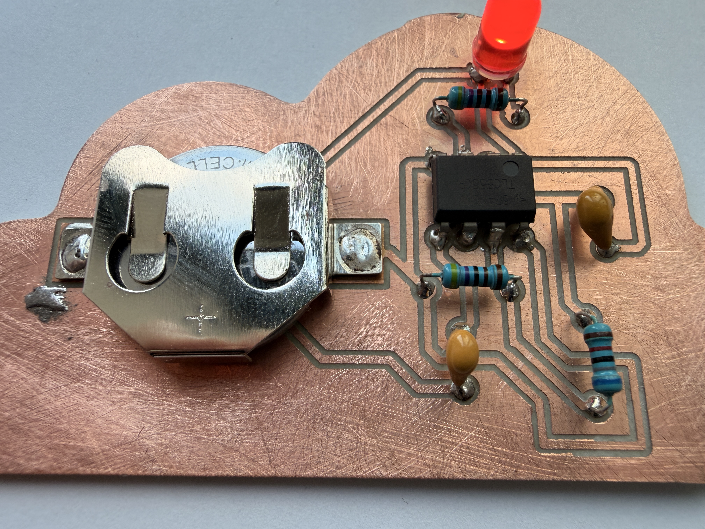
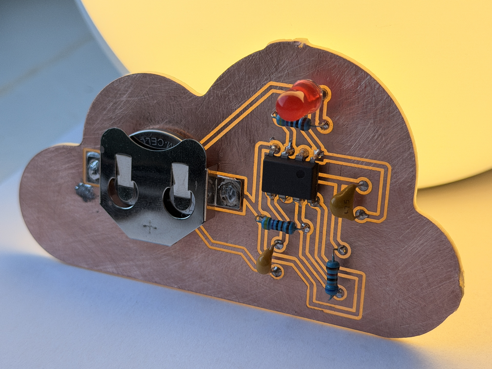

# ces_pcb_pendant
PCB Pendant Assignment for Creative Embedded Systems, Spring 2026

This project involved creating a PCB pendant from scratch (KiCAD -> Milling -> Soldering) using a TLC555CP timer chip. My pendant can be powered using a 3.7V coin cell battery.

All design files required to reproduce my PCB pendant, including the schematic, PCB layout, Gerber files, and CNC-friendly SVG files can be found under 'design_files'.

## software & tools required
- KiCad 
- Easel (or any CNC software)
- CNC Milling Machine
- Soldering Station (and required soldering materials)

## reproducibility instructions
1. Clone the repository
2. If modifying KiCad design, open *design_files/555timerCES.kicad_pro* in KiCad and follow SVG conversion in Step 2 of assignment spec found <a href="https://github.com/Barnard-PL-Labs/PCB-Milling-Project-for-Creative-Embedded-Systems/blob/main/README.md">here</a>
3. If not modifying KiCad design, open SVG files in CNC software and mill on CNC machine according to assignment spec

## installation / assembly instructions

Specific Components Used:
- TLC555CP Timer
- Coin Cell Battery Holder
- R1: 4.7K
- R2: 68K
- R3: 470R
- C1: 4.7 nF
- C2: 10 nF
- Red LED (2.0 - 2.2v)
- CR2032 Coin Cell Battery (3V)

1. The components above result in an LED flashing frequency of 2.178 Hz according to calculator found <a href="https://www.allaboutcircuits.com/tools/555-timer-astable-circuit/">here</a> 
2. Solder components onto the PCB board according to PCB design found in *design_files/555timerCES.kicad_pcb* or your own modified layout from KiCad

## usage instructions

1. Once all components are soldered, enter coin cell battery onto battery holder to verify LED flashing
2. To turn off flashing, remove battery from holder.

## resulting pcb pendant
The final PCB pendant can seen below.  

## more technical details!
### KiCAD PCB Design

I was given the KiCad schematic file in the assignment spec found <a href="https://github.com/Barnard-PL-Labs/PCB-Milling-Project-for-Creative-Embedded-Systems/blob/main/README.md">here</a> with more details about the circuit found <a href="https://www.allaboutcircuits.com/tools/555-timer-astable-circuit/">here</a> (excluding the NE555).  

To design my PCB layout, I centered my design around my timer chip in the middle. My final PCB design in KiCad can be seen below and under "design_files". 

### Milling PCB Design on Carvey CNC

After generating SVGs for my pendant (drill holes, edge cuts, and traces), I was able to carve my PCB pendant using a Carvey CNC. The resulting CNC-friendly SVGs for everything can be found under 'design_files'.

### Soldering Components

In terms of components, I chose to follow the component values from the tutorial video. In terms of technical challenges, I ran into trouble soldering the battery holder onto my board, resulting in the holder unattaching from the board, leaving behind extra solder (pictured below). 

  

To fix this, I ended up soldering a new battery holder on top of the extra solder, resulting in the battery holder being a bit more lifted off the board than usual (sideview included in photos below). 

## photos!

